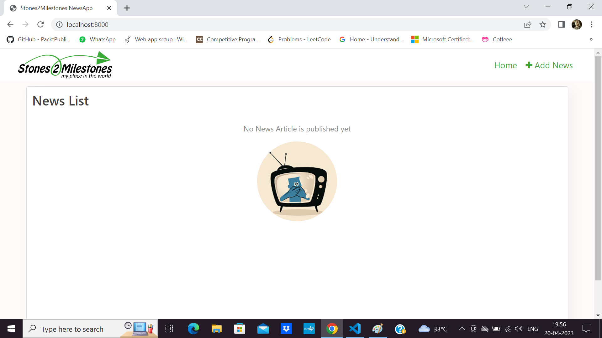
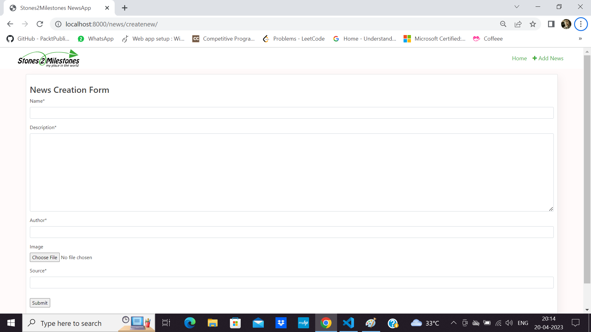
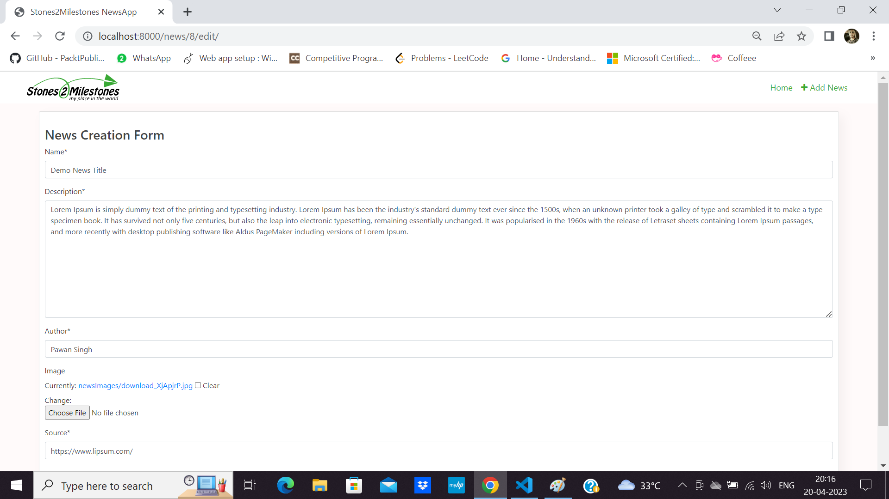
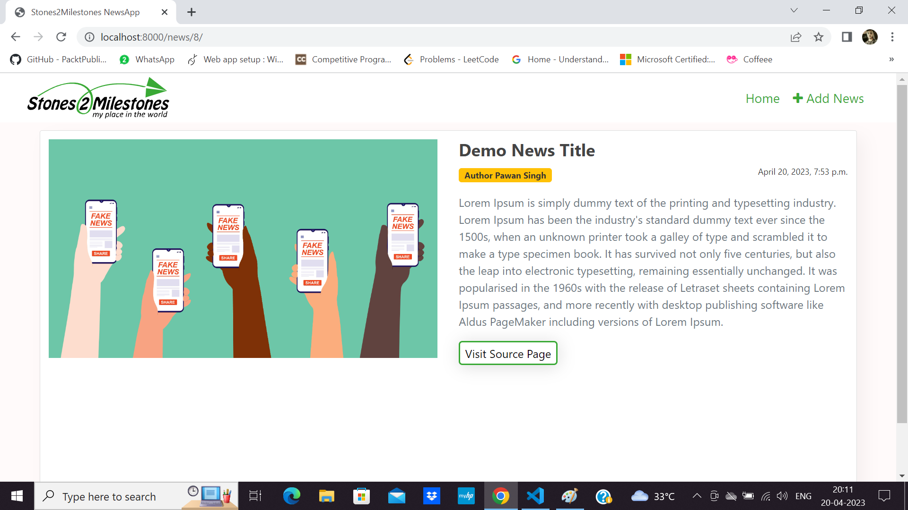

### Clone This Repo.
```
git clone https://github.com/11kaze/Stones2milestone_NewsApp.git
```
### Create Virtual environment
```
py -m venv env
```
### Activate your environment
```
.\env\Scripts\activate
```

### Install dependencies
```
pip3 install -r requirements.txt
```

### Now run
```
cd DjangoNewsProject
python manage.py runserver
```

### Some Sample Images





